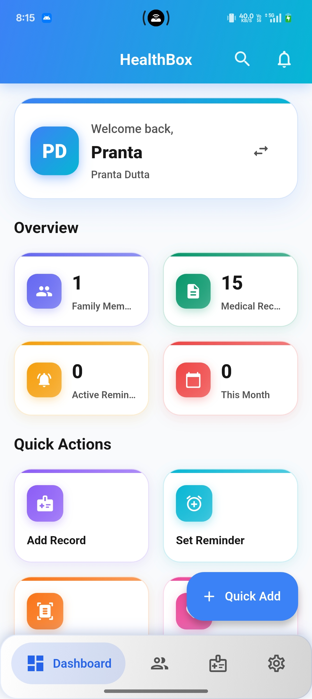
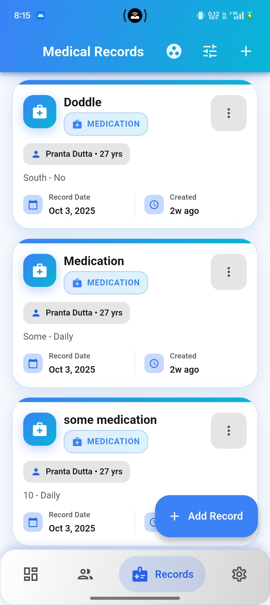
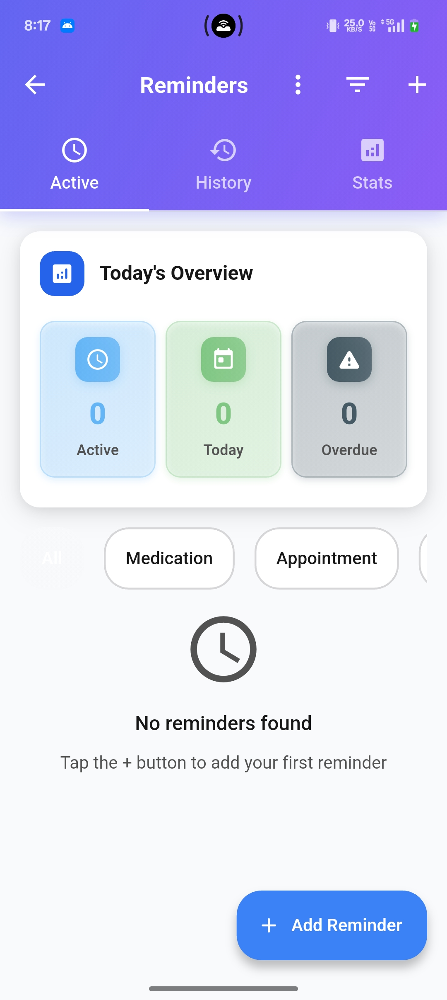
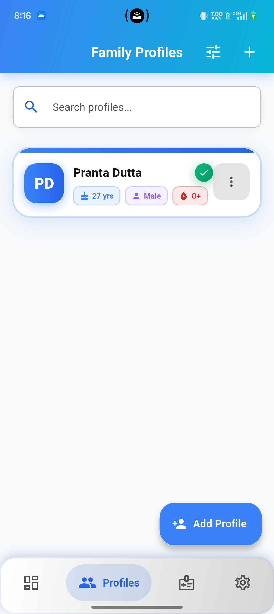
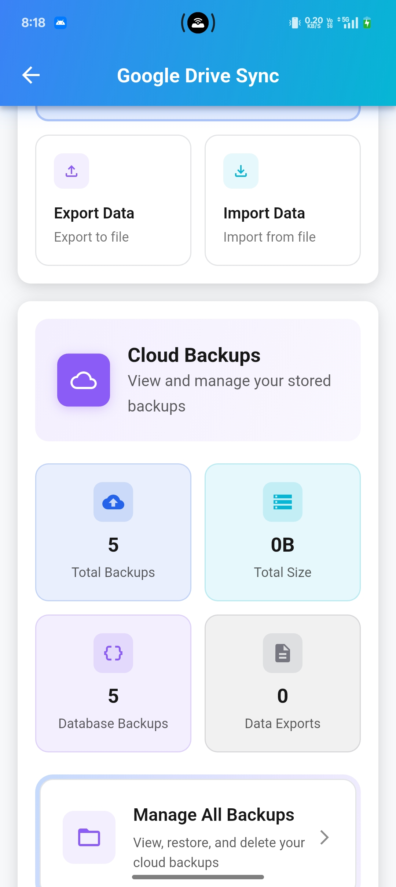
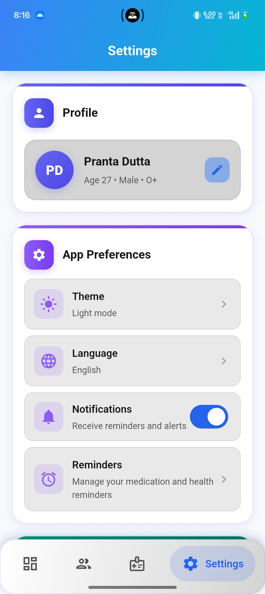

<div align="center">

# 🏥 HealthBox

### Secure, Private, Family-Focused Medical Management

[](https://flutter.dev)
[](https://dart.dev)
[](LICENSE)
[](https://github.com/theprantadutta/health_box)
[](metadata/release_notes.md)

**A privacy-first, offline-first Flutter mobile application for managing your family's medical information with complete security and convenience.**

[Features](#-features) • [Screenshots](#-screenshots) • [Getting Started](#-getting-started) • [Documentation](#-documentation) • [Contributing](#-contributing)

</div>

---

## 📑 Table of Contents

- [Overview](#-overview)
- [Features](#-features)
  - [Medical Records Management](#-medical-records-management)
  - [Smart Reminders & Notifications](#-smart-reminders--notifications)
  - [Family Profile Management](#-family-profile-management)
  - [Cloud Sync & Backup](#-cloud-sync--backup)
  - [Security & Privacy](#-security--privacy)
  - [Export & Import](#-export--import)
  - [Emergency Features](#-emergency-features)
  - [OCR & Document Scanning](#-ocr--document-scanning)
  - [Analytics & Insights](#-analytics--insights)
  - [Modern UI/UX](#-modern-uiux)
- [Screenshots](#-screenshots)
- [Quick Start](#-quick-start)
- [For Developers](#-for-developers)
  - [Prerequisites](#prerequisites)
  - [Installation](#installation)
  - [Development Commands](#development-commands)
- [Architecture](#-architecture)
- [Technical Stack](#-technical-stack)
- [Project Structure](#-project-structure)
- [Database Schema](#-database-schema)
- [Core Systems](#-core-systems)
- [Security & Privacy](#-security--privacy-1)
- [Development Philosophy](#-development-philosophy)
- [Testing](#-testing)
- [Roadmap](#-roadmap)
- [Documentation](#-documentation)
- [Platform Support](#-platform-support)
- [FAQ](#-faq)
- [Contributing](#-contributing)
- [License](#-license)
- [Support](#-support)
- [Acknowledgments](#-acknowledgments)

---

## 🎯 Overview

**HealthBox** is a comprehensive, production-ready mobile application designed to help families securely manage their medical information. Built with privacy and security as core principles, HealthBox operates completely offline while offering optional encrypted cloud synchronization.

### Why HealthBox?

- **🔒 Privacy First**: No central servers, no mandatory login, your data stays on your device
- **📴 Offline First**: Core functionality works without internet connectivity
- **🔐 Military-Grade Encryption**: SQLCipher AES-256 encryption for all medical data
- **👨‍👩‍👧‍👦 Family Focused**: Manage medical records for multiple family members
- **💊 Comprehensive**: Support for 14 different medical record types
- **⏰ Smart Reminders**: Never miss medications or appointments
- **📊 Health Analytics**: Track vitals and visualize health trends
- **🎨 Modern Design**: Material 3 UI with beautiful gradients and smooth animations

### Project Stats

- **207 Dart Files** across modular feature architecture
- **26 Database Tables** with robust encryption
- **14 Medical Record Types** fully implemented
- **30+ Routes** for comprehensive navigation
- **12 Reminder Services** for advanced notification system
- **Production Ready** with onboarding, analytics, sync, and more

---

## ✨ Features

### 📋 Medical Records Management

Comprehensive support for **14 different types** of medical records:

1. **💊 Prescriptions** - Prescribed medications with dosage and doctor information
2. **💉 Medications** - Active medication tracking with refill management
3. **🧪 Lab Reports** - Laboratory test results with reference ranges
4. **🛡️ Vaccinations** - Immunization records with batch numbers and due dates
5. **🚨 Allergies** - Known allergies with severity levels and symptoms
6. **🏥 Chronic Conditions** - Long-term health conditions with management plans
7. **🔪 Surgical Records** - Surgery history with operation details and recovery notes
8. **📷 Radiology Records** - X-ray, CT, MRI, and ultrasound results
9. **🔬 Pathology Records** - Biopsy and histology reports
10. **📄 Discharge Summaries** - Hospital discharge documentation
11. **🏨 Hospital Admissions** - ER visits and admission records
12. **🦷 Dental Records** - Dental procedures and checkup history
13. **🧠 Mental Health Records** - Therapy sessions and psychiatric assessments
14. **📁 General Records** - Flexible record type for any other medical documents

#### Features for All Record Types:
- 📎 **File Attachments** - Images, PDFs, documents with preview capabilities
- 🏷️ **Custom Tagging** - Organize records with custom tags
- 🔍 **Full-Text Search** - Search across all fields and attachments
- 📅 **Date Filtering** - Filter by date ranges and record types
- 📝 **Rich Notes** - Detailed notes for each record
- 🔗 **Relationships** - Link related records together

### ⏰ Smart Reminders & Notifications

Advanced reminder system with **12 specialized services**:

- **💊 Medication Reminders** - Multiple daily doses with custom time slots
- **🏥 Appointment Notifications** - Doctor visit reminders with location
- **📋 Lab Test Alerts** - Recurring test reminders
- **🛡️ Vaccination Reminders** - Immunization due date tracking
- **💉 Refill Reminders** - Automatic medication refill alerts based on inventory
- **📊 Adherence Tracking** - Monitor medication compliance with calendar views
- **⏰ Alarm System** - Persistent alarms with custom sounds and volume control
- **🔔 Background Notifications** - Notifications work even when app is closed
- **⏸️ Snooze Functionality** - Customizable snooze intervals
- **📈 Adherence Statistics** - Visual adherence reports and trends
- **🔕 Flexible Scheduling** - Daily, weekly, monthly frequencies with custom patterns
- **🎵 Sound Customization** - Choose notification sounds and alarm tones

### 👨‍👩‍👧‍👦 Family Profile Management

- **Multi-Member Support** - Manage unlimited family member profiles
- **Comprehensive Demographics** - Name, DOB, gender, blood type, height, weight
- **Emergency Contacts** - Quick access to emergency contact information
- **Insurance Information** - Store insurance details for each family member
- **Profile Images** - Add photos to easily identify profiles
- **Relationship Tracking** - Define relationships between family members
- **Medical History** - Quick view of allergies and chronic conditions
- **Profile Switching** - Fast switching between family member profiles

### ☁️ Cloud Sync & Backup

Sophisticated Google Drive integration with **conflict resolution**:

- **Optional Encrypted Sync** - Choose what to sync and when
- **Automatic Backup** - Scheduled backups based on frequency preferences
- **Background Sync** - Sync occurs in background without interrupting usage
- **Conflict Resolution** - Smart conflict handling (local wins, remote wins, merge, or ask)
- **File Upload System** - Sync attachments to organized Google Drive folders
- **Selective Sync** - Choose to sync by file type and size limits
- **Upload Progress Tracking** - Real-time progress indicators for uploads
- **Backup History** - View and manage all backup versions
- **New User Onboarding** - Import existing backups when first signing in
- **WiFi-Only Option** - Restrict sync to WiFi connections to save data
- **Organized Folder Structure** - Medical records organized by type in Google Drive
- **Database Backups** - Complete encrypted database backups
- **Data Exports** - Structured JSON exports for portability

### 🔐 Security & Privacy

**Constitutional Principle**: Privacy is non-negotiable

- **SQLCipher Encryption** - AES-256 encryption for all local data
- **No Central Servers** - Your data never touches our servers
- **No Tracking** - Zero analytics, telemetry, or user tracking
- **No Mandatory Login** - Use completely offline without any account
- **Offline-First Design** - All core features work without internet
- **End-to-End Encryption** - Data encrypted before cloud upload
- **Device-Only Storage** - Medical information stays on your device
- **Transparent Privacy** - Full [Privacy Policy](PRIVACY_POLICY.md) and [Terms of Service](TERMS_OF_SERVICE.md)
- **Secure File Storage** - Encrypted file attachments
- **No Third-Party Sharing** - Your data is never sold or shared

### 📤 Export & Import

Multiple export formats for data portability:

- **JSON Export** - Complete structured data export
- **CSV Export** - Spreadsheet-compatible format
- **PDF Export** - Printable medical reports
- **ZIP Export** - Compressed archives with all attachments
- **Encrypted Backup** - Full database backup files
- **Selective Export** - Export specific profiles or record types
- **Import Functionality** - Import previously exported data
- **Data Restoration** - Restore from Google Drive or local backups
- **Emergency Card Generation** - QR-coded emergency information cards

### 🆘 Emergency Features

Quick access to critical information:

- **Emergency Cards** - Generate printable emergency medical cards
- **QR Code Generation** - Scannable QR codes with critical health info
- **Offline Access** - Emergency cards work without internet
- **Customizable Content** - Choose what information to include
- **PDF Export** - Print emergency cards for wallet/purse
- **Critical Allergies** - Highlight life-threatening allergies
- **Emergency Contacts** - Quick access to emergency contact numbers
- **Current Medications** - List of active medications for first responders

### 📸 OCR & Document Scanning

Powered by Google ML Kit:

- **Text Recognition** - Extract text from medical documents
- **Prescription Scanning** - Scan prescription documents
- **Lab Report OCR** - Extract data from lab reports
- **Medical Report Processing** - Parse various medical documents
- **Camera Integration** - Capture documents directly in-app
- **Gallery Import** - Import existing document images
- **Structured Data Extraction** - Smart parsing of medical information
- **Multiple OCR Types** - Specialized processing for different document types

### 📊 Analytics & Insights

Track and visualize health trends:

- **Vitals Tracking** - Monitor 8+ vital sign types:
  - Blood Pressure (systolic/diastolic)
  - Heart Rate
  - Temperature
  - Weight & Height
  - Blood Sugar
  - Cholesterol
  - Oxygen Saturation
  - Respiratory Rate
  - BMI (automatic calculation)
- **Interactive Charts** - Beautiful fl_chart visualizations
- **Trend Analysis** - Increasing, decreasing, stable, volatile trends
- **Time Ranges** - Week, month, 3 months, 6 months, year, all-time
- **Health Calendar** - table_calendar integration for tracking
- **Adherence Statistics** - Medication compliance visualization
- **Export Charts** - Share health trends with providers

### 🎨 Modern UI/UX

Material 3 design with custom enhancements:

- **Material 3 Design System** - Latest Material Design guidelines
- **Custom Design Tokens** - Comprehensive color, typography, spacing system
- **Gradient AppBars** - Beautiful gradient header with medical blue theme
- **Smooth Animations** - Page transitions, micro-interactions, staggered lists
- **Dark/Light Themes** - System-aware theme switching
- **Accessibility Features** - High contrast, text scaling, reduced animations
- **Responsive Layout** - Optimized for phones and tablets
- **Bottom Navigation** - Enhanced Salomon bottom bar with smooth transitions
- **Card-Based UI** - Clean card layouts with shadows and rounded corners
- **Modern Components** - Custom TextField, GradientButton, GradientChip widgets
- **Loading States** - Beautiful loading animations
- **Error Handling** - User-friendly error displays
- **Intuitive Navigation** - GoRouter with 30+ routes

---

## 📱 Screenshots

<div align="center">

### 🏠 Dashboard & Home

*Modern Material 3 dashboard with quick access to all features*

### 📋 Medical Records Management

*Comprehensive medical records with 14 different record types*

### ⏰ Smart Reminders & Adherence Tracking

*Never miss a dose with smart medication reminders and adherence calendar*

### 👥 Family Profiles

*Manage medical information for your entire family in one place*

### 📊 Health Analytics & Trends

*Track vitals and visualize health trends with interactive charts*

### ⚙️ Settings & Customization

*Comprehensive settings including privacy, notifications, and Google Drive sync*

</div>

---

## 🚀 Quick Start

### For Users

1. **Download** the app from Google Play Store or Apple App Store (coming soon)
2. **Launch** the app and complete the onboarding
3. **Create** your first family member profile
4. **Add** your first medical record
5. **Set up** medication reminders if needed
6. **Optionally** enable Google Drive sync for backup

### First-Time Setup

The app includes an **interactive onboarding** that guides you through:
- Privacy and security explanation
- Core features overview
- Optional Google Drive setup
- First profile creation

---

## 💻 For Developers

### Prerequisites

- **Flutter SDK** 3.16 or higher
- **Dart SDK** 3.2 or higher
- **Android Studio** or **VS Code** with Flutter extensions
- **Android SDK** (for Android development) or **Xcode** (for iOS development)
- **Git** for version control

### Installation

1. **Clone the repository**
   ```bash
   git clone https://github.com/theprantadutta/health_box.git
   cd health_box
   ```

2. **Install dependencies**
   ```bash
   flutter pub get
   ```

3. **Generate code** (Drift database + Riverpod providers)
   ```bash
   dart run build_runner build --delete-conflicting-outputs
   ```

4. **Run the app**
   ```bash
   flutter run
   ```

   Select your device (Android emulator, iOS simulator, or physical device)

### Development Commands

```bash
# Install dependencies
flutter pub get

# Generate code (after model/provider changes)
dart run build_runner build --delete-conflicting-outputs

# Watch mode for continuous code generation
dart run build_runner watch

# Run tests
flutter test                        # Unit and widget tests
flutter test integration_test/      # Integration tests

# Code analysis
flutter analyze                     # Static analysis
dart run custom_lint                # Custom lint rules

# Format code
dart format .                       # Format all Dart files

# Build for production
flutter build apk --release         # Android APK
flutter build appbundle --release   # Android App Bundle
flutter build ios --release         # iOS build

# Clean build cache
flutter clean
flutter pub get
dart run build_runner build --delete-conflicting-outputs
```

### Project Configuration

1. **Firebase Setup** (if using Firebase)
   - Add `google-services.json` for Android in `android/app/`
   - Add `GoogleService-Info.plist` for iOS in `ios/Runner/`

2. **Google Drive API**
   - Configure OAuth 2.0 credentials in Google Cloud Console
   - Update configuration in `lib/firebase_options.dart`

3. **Alarm Sounds**
   - Add custom alarm sounds to `assets/sounds/`
   - Update `pubspec.yaml` assets section

---

## 🏗️ Architecture

HealthBox follows **clean architecture** principles with feature-based modularization:

```
┌─────────────────────────────────────────────────────────────────┐
│                         UI Layer (Screens/Widgets)              │
│                  Material 3 Design • Responsive                 │
└───────────────────────────────┬─────────────────────────────────┘
                                │
                                ▼
┌─────────────────────────────────────────────────────────────────┐
│                    State Management (Riverpod)                  │
│              Providers • Notifiers • State                      │
└───────────────────────────────┬─────────────────────────────────┘
                                │
                                ▼
┌─────────────────────────────────────────────────────────────────┐
│                      Business Logic (Services)                  │
│    Medical Records • Reminders • Sync • OCR • Analytics        │
└───────────────────────────────┬─────────────────────────────────┘
                                │
                                ▼
┌─────────────────────────────────────────────────────────────────┐
│                    Data Access Layer (DAOs)                     │
│              Drift Repositories • CRUD Operations               │
└───────────────────────────────┬─────────────────────────────────┘
                                │
                                ▼
┌─────────────────────────────────────────────────────────────────┐
│                 Database (Drift + SQLCipher)                    │
│              Encrypted SQLite • 26 Tables • Migrations          │
└─────────────────────────────────────────────────────────────────┘
```

### Data Flow

```
User Input → Widget → Provider → Service → DAO → Database
                                              ↓
Database → DAO → Provider → Widget → UI Update
```

### Feature-Based Modularization

Each feature is self-contained with its own:
- **Screens** - UI for the feature
- **Services** - Business logic
- **Providers** - State management
- **Widgets** - Reusable components
- **Models** - Data structures (if feature-specific)

---

## 🛠️ Technical Stack

### Core Framework
- **Flutter** 3.16+ - Cross-platform UI framework
- **Dart** 3.2+ - Programming language

### State Management
- **flutter_riverpod** 3.0.0 - Modern state management with annotation syntax
- **riverpod_annotation** 3.0.0 - Code generation for providers
- **riverpod_generator** 3.0.0 - Provider code generation
- **riverpod_lint** 3.0.0 - Linting rules for Riverpod

### Database & Storage
- **drift** 2.28.1 - Type-safe SQLite wrapper
- **encrypted_drift** (git) - SQLCipher encryption for Drift
- **path_provider** 2.1.5 - Access device directories
- **shared_preferences** 2.3.2 - Key-value storage
- **sqflite** - Underlying SQLite engine

### UI & Design
- **material_color_utilities** 0.11.1 - Material 3 color system
- **cupertino_icons** 1.0.8 - iOS-style icons
- **fl_chart** 1.1.0 - Beautiful charts
- **table_calendar** 3.1.2 - Calendar widget

### Navigation
- **go_router** 16.2.1 - Declarative routing

### File Operations
- **file_picker** 10.3.2 - File selection
- **image_picker** 1.2.0 - Image selection from camera/gallery
- **image** 4.2.0 - Image processing
- **archive** 4.0.7 - ZIP compression
- **csv** 6.0.0 - CSV export
- **pdf** 3.11.1 - PDF generation
- **qr_flutter** 4.1.0 - QR code generation

### Notifications & Reminders
- **flutter_local_notifications** 19.4.2 - Local notifications
- **timezone** 0.10.1 - Timezone support
- **alarm** 5.1.2 - Persistent alarms
- **audioplayers** 6.1.0 - Audio playback for alarms

### Cloud Services
- **google_sign_in** 7.1.1 - Google authentication
- **googleapis** 14.0.0 - Google APIs
- **googleapis_auth** 2.0.0 - Google OAuth2
- **http** 1.2.2 - HTTP client

### Firebase
- **firebase_core** 3.14.0 - Firebase initialization

### ML & OCR
- **google_ml_kit** 0.20.0 - Machine learning toolkit
- **google_mlkit_text_recognition** - Text recognition

### Utilities
- **uuid** 4.5.1 - UUID generation
- **crypto** 3.0.5 - Cryptographic functions
- **logger** 2.4.0 - Logging
- **connectivity_plus** 7.0.0 - Network connectivity
- **intl** 0.20.2 - Internationalization

### Development Tools
- **build_runner** 2.7.1 - Code generation
- **drift_dev** 2.28.2 - Drift code generator
- **flutter_lints** 6.0.0 - Linting rules
- **very_good_analysis** 10.0.0 - Strict linting
- **mockito** 5.4.4 - Mocking for tests
- **build_test** 3.3.3 - Testing for code generation

---

## 📂 Project Structure

```
health_box/
├── android/                      # Android platform code
├── ios/                          # iOS platform code
├── assets/                       # Asset files
│   └── sounds/                   # Alarm sounds and notifications
├── lib/                          # Main application code
│   ├── main.dart                 # App entry point (30KB)
│   ├── firebase_options.dart     # Firebase configuration
│   ├── data/                     # Data layer
│   │   ├── database/             # Drift database setup
│   │   │   ├── app_database.dart # Master database schema (26 tables)
│   │   │   └── app_database.g.dart # Generated code
│   │   ├── models/               # Data models (26 model files)
│   │   │   ├── family_member_profile.dart
│   │   │   ├── medical_record.dart
│   │   │   ├── prescription.dart
│   │   │   ├── medication.dart
│   │   │   ├── lab_report.dart
│   │   │   ├── vaccination.dart
│   │   │   ├── allergy.dart
│   │   │   ├── chronic_condition.dart
│   │   │   ├── surgical_record.dart
│   │   │   ├── radiology_record.dart
│   │   │   ├── pathology_record.dart
│   │   │   ├── discharge_summary.dart
│   │   │   ├── hospital_admission.dart
│   │   │   ├── dental_record.dart
│   │   │   ├── mental_health_record.dart
│   │   │   ├── general_record.dart
│   │   │   ├── reminder.dart
│   │   │   ├── attachment.dart
│   │   │   ├── tag.dart
│   │   │   ├── emergency_card.dart
│   │   │   └── ... (other models)
│   │   ├── repositories/         # Data Access Objects (7 DAOs)
│   │   │   ├── profile_dao.dart
│   │   │   ├── medical_record_dao.dart
│   │   │   ├── reminder_dao.dart
│   │   │   ├── attachment_dao.dart
│   │   │   ├── tag_dao.dart
│   │   │   ├── medication_adherence_dao.dart
│   │   │   └── notification_settings_dao.dart
│   │   └── services/             # Data services
│   ├── features/                 # Feature modules (8 features)
│   │   ├── dashboard/            # Dashboard feature
│   │   │   ├── screens/
│   │   │   ├── widgets/
│   │   │   └── providers/
│   │   ├── medical_records/      # Medical records feature
│   │   │   ├── screens/          # 15+ form screens
│   │   │   ├── services/         # 17 service files
│   │   │   ├── widgets/          # Reusable widgets
│   │   │   └── providers/        # State providers
│   │   ├── reminders/            # Reminders & notifications
│   │   │   ├── screens/          # Reminder screens
│   │   │   ├── services/         # 12 reminder services
│   │   │   ├── widgets/          # Reminder widgets
│   │   │   └── providers/        # Reminder state
│   │   ├── sync/                 # Google Drive sync
│   │   │   ├── screens/          # Sync settings screen
│   │   │   ├── services/         # Sync services
│   │   │   ├── widgets/          # Sync UI components
│   │   │   └── providers/        # Sync providers
│   │   ├── profiles/             # Family profiles
│   │   │   ├── screens/          # Profile screens
│   │   │   ├── services/         # Profile services
│   │   │   ├── widgets/          # Profile widgets
│   │   │   └── providers/        # Profile state
│   │   ├── export/               # Export & import
│   │   │   ├── screens/          # Export/import screens
│   │   │   ├── services/         # Export services
│   │   │   ├── widgets/          # Export widgets
│   │   │   └── providers/        # Export providers
│   │   ├── analytics/            # Health analytics
│   │   │   ├── screens/          # Analytics screens
│   │   │   ├── services/         # Analytics services
│   │   │   └── widgets/          # Chart widgets
│   │   └── ocr/                  # OCR scanning
│   │       ├── screens/          # OCR scan screen
│   │       └── services/         # OCR services
│   ├── screens/                  # Main app screens (4 screens)
│   │   ├── splash_screen.dart    # App initialization
│   │   ├── onboarding_screen.dart # First-time setup (21KB)
│   │   ├── main_app_screen.dart  # App shell with navigation
│   │   └── settings_screen.dart  # Settings (54KB)
│   ├── services/                 # Root-level services
│   │   ├── google_drive_service.dart # Google Drive integration
│   │   ├── attachment_service.dart   # File management
│   │   ├── tag_service.dart          # Tag management
│   │   ├── search_service.dart       # Full-text search
│   │   ├── logging_service.dart      # Logging
│   │   └── app_lifecycle_service.dart # Lifecycle management
│   ├── shared/                   # Shared resources
│   │   ├── providers/            # Global providers (10+ files)
│   │   │   ├── app_providers.dart
│   │   │   ├── profile_providers.dart
│   │   │   ├── medical_records_providers.dart
│   │   │   ├── reminder_providers.dart
│   │   │   ├── settings_providers.dart
│   │   │   ├── backup_preference_providers.dart
│   │   │   ├── onboarding_providers.dart
│   │   │   ├── accessibility_providers.dart
│   │   │   ├── connectivity_provider.dart
│   │   │   └── persistence_providers.dart
│   │   ├── widgets/              # Reusable widgets (20+ widgets)
│   │   │   ├── modern_text_field.dart
│   │   │   ├── modern_card.dart
│   │   │   ├── gradient_button.dart
│   │   │   ├── gradient_chip.dart
│   │   │   ├── error_state_widget.dart
│   │   │   ├── loading_animation_widget.dart
│   │   │   ├── attachment_form_widget.dart
│   │   │   ├── attachment_view_widget.dart
│   │   │   ├── tag_selector_widget.dart
│   │   │   └── ... (other widgets)
│   │   ├── theme/                # Design system & theming
│   │   │   ├── app_theme.dart    # Material 3 themes
│   │   │   └── design_system.dart # Design tokens
│   │   ├── navigation/           # Routing & navigation
│   │   │   ├── app_router.dart   # GoRouter configuration (30+ routes)
│   │   │   └── navigation_keys.dart
│   │   ├── animations/           # Animation utilities
│   │   │   ├── common_transitions.dart
│   │   │   ├── page_transitions.dart
│   │   │   ├── stagger_animations.dart
│   │   │   └── micro_interactions.dart
│   │   └── utils/                # Utility functions
│   │       ├── date_utils.dart
│   │       ├── file_utils.dart
│   │       ├── validation_utils.dart
│   │       └── accessibility_utils.dart
│   └── l10n/                     # Localization
│       ├── app_localizations.dart
│       └── arb/                  # Translation files
├── test/                         # Test files
│   ├── unit/                     # Unit tests
│   ├── widget/                   # Widget tests
│   └── integration/              # Integration tests
├── integration_test/             # E2E tests
├── docs/                         # Technical documentation
│   ├── alarm_package_reference.md
│   └── flutter_local_notifications_reference.md
├── specs/                        # Feature specifications
│   └── 001-build-a-mobile/       # Initial spec
│       ├── spec.md
│       ├── plan.md
│       ├── research.md
│       ├── data-model.md
│       └── quickstart.md
├── memory/                       # Project memory/constitution
│   ├── constitution.md           # Core principles
│   └── constitution_update_checklist.md
├── metadata/                     # App metadata
│   ├── release_notes.md
│   └── screenshots_guide.md
├── scripts/                      # Build and utility scripts
├── templates/                    # Code templates
├── tools/                        # Development tools
├── .claude/                      # Claude Code configuration
│   └── commands/                 # Slash commands
├── pubspec.yaml                  # Dependencies
├── analysis_options.yaml         # Linting configuration
├── build.yaml                    # Build runner configuration
├── README.md                     # This file
├── PRIVACY_POLICY.md             # Privacy policy
├── TERMS_OF_SERVICE.md           # Terms of service
├── CLAUDE.md                     # Development guidelines
├── google-drive-backup-system.md # Sync system documentation
├── medical-records-enhancement-plan.md # Enhancement roadmap
└── LICENSE                       # Project license
```

---

## 🗄️ Database Schema

HealthBox uses **Drift** (SQLite) with **SQLCipher encryption** for secure data storage.

### Tables (26 Total)

#### Core Tables
- **FamilyMemberProfiles** - Family member information
- **MedicalRecords** - Base medical records table
- **Tags** - Custom tags for organization
- **Attachments** - File attachments
- **SearchHistory** - Search history tracking

#### Medical Record Types (14 Tables)
- **Prescriptions** - Prescribed medications
- **Medications** - Active medications
- **LabReports** - Laboratory test results
- **Vaccinations** - Immunization records
- **Allergies** - Allergy information
- **ChronicConditions** - Chronic health conditions
- **SurgicalRecords** - Surgery history
- **RadiologyRecords** - Imaging results
- **PathologyRecords** - Pathology reports
- **DischargeSummaries** - Discharge documents
- **HospitalAdmissions** - Hospital stays
- **DentalRecords** - Dental procedures
- **MentalHealthRecords** - Mental health records
- **GeneralRecords** - General medical records

#### Reminder & Notification Tables
- **Reminders** - Medication and appointment reminders
- **MedicationAdherence** - Adherence tracking
- **NotificationSettings** - Notification preferences
- **MedicationBatches** - Medication batch/inventory

#### Sync & Settings Tables
- **SyncPreferences** - Sync settings and preferences
- **UploadQueue** - File upload queue for sync
- **EmergencyCards** - Emergency card configurations

#### Relationship Tables
- **RecordTags** - Many-to-many record-tag relationships

### Database Features
- **Schema Version**: 10 (with migration support)
- **Encryption**: SQLCipher AES-256
- **Foreign Keys**: Enabled with cascade deletes
- **Constraints**: Data validation at database level
- **Transactions**: ACID compliance
- **Migrations**: Automatic schema migrations

---

## ⚙️ Core Systems

### Reminder System Architecture

The reminder system consists of **12 specialized services**:

1. **ReminderService** - Core CRUD operations for reminders
2. **AlarmService** - Alarm scheduling and management
3. **NotificationService** - Push notification handling
4. **NotificationAlarmService** - Combined alarm + notification
5. **PersistentNotificationService** - Background notifications
6. **RefillReminderService** - Medication refill alerts
7. **MedicationAdherenceService** - Adherence tracking
8. **BatchReminderScheduler** - Bulk reminder operations
9. **NotificationSettingsService** - User preferences
10. **PermissionManager** - Permission handling
11. **NotificationConfig** - Configuration management
12. **ReminderScheduler** - Schedule management

### Google Drive Sync System

Comprehensive sync with conflict resolution:

- **Authentication** - OAuth2 with Google Sign-In
- **Folder Management** - Organized folder structure by record type
- **File Upload** - Background upload with progress tracking
- **Conflict Resolution** - Multiple strategies (local, remote, merge, ask)
- **Background Sync** - Automatic backups based on frequency
- **New User Onboarding** - Import existing backups on first sign-in

For detailed documentation, see [google-drive-backup-system.md](google-drive-backup-system.md)

### OCR System

Powered by Google ML Kit:

- **Text Recognition** - Extract text from images
- **Document Types** - Prescription, lab reports, medical reports, general
- **Image Sources** - Camera or gallery
- **Structured Extraction** - Parse medical information intelligently

### Export System

Multiple export formats:

- **JSON** - Complete structured data
- **CSV** - Spreadsheet format
- **PDF** - Printable reports with QR codes
- **ZIP** - Compressed archives
- **Backup** - Encrypted database files

---

## 🔐 Security & Privacy

### Constitutional Principles

Per [memory/constitution.md](memory/constitution.md):

1. **Privacy-First (NON-NEGOTIABLE)** - All medical data belongs to the user
2. **Offline-First** - App must work fully offline
3. **Simplicity & Accessibility** - Clean, intuitive UI for all ages
4. **Reliability & Data Integrity** - No data loss or corruption
5. **Extensibility & Modularity** - Feature-based architecture

### Security Features

- **SQLCipher Encryption** - AES-256 encryption for local database
- **No Central Servers** - Data never touches our servers
- **No Tracking** - Zero analytics, telemetry, or usage tracking
- **Offline-First** - Core features work without internet
- **End-to-End Encryption** - Data encrypted before cloud upload
- **Secure File Storage** - Encrypted file attachments
- **No Third-Party Sharing** - Data never sold or shared

### Privacy Compliance

- **GDPR** - Aligned with GDPR requirements
- **CCPA** - California privacy compliance
- **HIPAA** - Follows HIPAA Privacy Rule principles

For complete details, see:
- [PRIVACY_POLICY.md](PRIVACY_POLICY.md)
- [TERMS_OF_SERVICE.md](TERMS_OF_SERVICE.md)

---

## 🧑‍💻 Development Philosophy

### Code Quality

- **Linting** - `very_good_analysis` for strict linting
- **Static Analysis** - Regular `flutter analyze`
- **Code Generation** - Drift and Riverpod code generation
- **Formatting** - Consistent Dart formatting

### Testing Strategy

- **Test-Driven Development** - Tests before implementation
- **Unit Tests** - Business logic testing
- **Widget Tests** - UI component testing
- **Integration Tests** - End-to-end user flows

### Git Workflow

- **Conventional Commits** - Standardized commit messages
- **Feature Branches** - Isolated feature development
- **No Claude Attribution** - Clean commit messages without AI attribution

### Documentation

- **Code Comments** - Clear inline documentation
- **Markdown Docs** - Comprehensive markdown documentation
- **Architecture Docs** - System design documentation

---

## 🧪 Testing

### Test Structure

```
test/
├── unit/           # Unit tests for business logic
├── widget/         # Widget tests for UI components
└── integration/    # Integration tests for features

integration_test/   # E2E tests for user journeys
```

### Running Tests

```bash
# Run all unit and widget tests
flutter test

# Run integration tests
flutter test integration_test/

# Run specific test file
flutter test test/unit/services/reminder_service_test.dart

# Run with coverage
flutter test --coverage
```

### Test Coverage Goals

- **Services**: 80%+ coverage
- **Widgets**: 70%+ coverage
- **Models**: 90%+ coverage (validation logic)
- **Integration**: Critical user paths covered

---

## 🗺️ Roadmap

### ✅ Completed Features (Phases 1-4)

#### Phase 1: Database & Models Enhancement (100% Complete)
- ✅ 14 medical record types implemented
- ✅ Enhanced attachment system with file previews
- ✅ Prescription/Appointment combined model
- ✅ File validation and size limits

#### Phase 2: UI Implementation (100% Complete)
- ✅ 15+ medical record form screens
- ✅ File attachment UI with preview
- ✅ Camera integration
- ✅ Enhanced list/detail views
- ✅ File thumbnails and galleries

#### Phase 3: Medication Reminder System (100% Complete)
- ✅ Smart scheduling engine
- ✅ Multiple daily doses support
- ✅ Snooze functionality
- ✅ Persistent notifications
- ✅ Medication adherence tracking
- ✅ Refill reminders
- ✅ Alarm system with custom sounds

#### Phase 4: Enhanced Google Drive Sync (100% Complete)
- ✅ File upload preferences
- ✅ Selective sync by file type
- ✅ Upload progress tracking
- ✅ Background upload queue
- ✅ Organized folder structure
- ✅ Real-time sync status
- ✅ Conflict resolution
- ✅ New user onboarding

### 🚧 In Progress (Phases 5-7)

#### Phase 5: Services & Providers (0% Complete)
- [ ] VaccinationService implementation
- [ ] AllergyService implementation
- [ ] ChronicConditionService implementation
- [ ] Enhanced file upload providers
- [ ] Reminder scheduling providers
- [ ] State management optimization

#### Phase 6: UI/UX Polish (0% Complete)
- [ ] File attachment card improvements
- [ ] Progress indicator enhancements
- [ ] Material 3 design consistency
- [ ] Responsive layouts for tablets
- [ ] Navigation refinements
- [ ] Dashboard widget updates

#### Phase 7: Code Quality & Analysis (0% Complete)
- [ ] Fix deprecation warnings
- [ ] Resolve unused variables/fields
- [ ] Code cleanup and optimization
- [ ] Complete documentation
- [ ] Clean `flutter analyze` run

### 🔮 Future Enhancements

- [ ] **Enhanced Medication Interaction Checker** - Drug interaction warnings
- [ ] **Health Trend Predictions** - AI-powered health insights
- [ ] **Doctor Appointment Booking** - Integrated appointment scheduling
- [ ] **Multi-Language Support** - Internationalization
- [ ] **Wearable Integration** - Apple Health / Google Fit sync
- [ ] **Voice Notes** - Audio memo attachments
- [ ] **Telemedicine Integration** - Video consultation support
- [ ] **Prescription Auto-Refill** - Pharmacy integration
- [ ] **Family Sharing** - Secure sharing between family members
- [ ] **Web Platform** - Web version of the app
- [ ] **Desktop Apps** - Windows, macOS, Linux support

For detailed progress, see [medical-records-enhancement-plan.md](medical-records-enhancement-plan.md)

---

## 📚 Documentation

### Main Documentation
- [README.md](README.md) - This file
- [CLAUDE.md](CLAUDE.md) - Development guidelines and project instructions
- [PRIVACY_POLICY.md](PRIVACY_POLICY.md) - Privacy policy
- [TERMS_OF_SERVICE.md](TERMS_OF_SERVICE.md) - Terms of service

### Technical Documentation
- [google-drive-backup-system.md](google-drive-backup-system.md) - Google Drive sync architecture
- [medical-records-enhancement-plan.md](medical-records-enhancement-plan.md) - Feature enhancement roadmap
- [memory/constitution.md](memory/constitution.md) - Project constitutional principles

### Specifications
- [specs/001-build-a-mobile/spec.md](specs/001-build-a-mobile/spec.md) - Original feature specification
- [specs/001-build-a-mobile/plan.md](specs/001-build-a-mobile/plan.md) - Implementation plan
- [specs/001-build-a-mobile/data-model.md](specs/001-build-a-mobile/data-model.md) - Data model design
- [specs/001-build-a-mobile/research.md](specs/001-build-a-mobile/research.md) - Technical research
- [specs/001-build-a-mobile/quickstart.md](specs/001-build-a-mobile/quickstart.md) - Quick start guide

### Package Documentation
- [docs/alarm_package_reference.md](docs/alarm_package_reference.md) - Alarm package reference
- [docs/flutter_local_notifications_reference.md](docs/flutter_local_notifications_reference.md) - Notifications reference

### Release Information
- [metadata/release_notes.md](metadata/release_notes.md) - Release notes
- [metadata/screenshots_guide.md](metadata/screenshots_guide.md) - Screenshot guidelines

---

## 🌐 Platform Support

| Platform | Version | Status |
|----------|---------|--------|
| **Android** | 7.0+ (API 24+) | ✅ Fully Supported |
| **iOS** | 12.0+ | ✅ Fully Supported |
| **Web** | - | 🔄 Future |
| **Windows** | - | 🔄 Future |
| **macOS** | - | 🔄 Future |
| **Linux** | - | 🔄 Future |

### System Requirements

**Android:**
- Android 7.0 (Nougat) or higher
- 100MB+ free storage space
- Camera permission (optional, for OCR)
- Notification permission (for reminders)

**iOS:**
- iOS 12.0 or higher
- 100MB+ free storage space
- Camera permission (optional, for scanning)
- Notification permission (for reminders)

---

## ❓ FAQ

### General Questions

**Q: Is my medical data safe?**
A: Yes! All data is encrypted with SQLCipher AES-256 encryption and stored only on your device. We don't have access to your data.

**Q: Do I need an internet connection?**
A: No! HealthBox works completely offline. Internet is only needed for optional Google Drive sync.

**Q: Can I use this for my entire family?**
A: Yes! HealthBox supports unlimited family member profiles.

**Q: How much does it cost?**
A: HealthBox is completely free with no ads or in-app purchases.

### Sync & Backup

**Q: Is Google Drive sync mandatory?**
A: No, it's completely optional. You can use HealthBox entirely offline.

**Q: Is my data encrypted in Google Drive?**
A: Yes! Data is encrypted before upload. Even Google can't read your medical information.

**Q: Can I restore my data on a new device?**
A: Yes! Sign in with the same Google account and restore from your backup.

### Privacy & Security

**Q: Do you track my usage?**
A: No! HealthBox has zero analytics, telemetry, or tracking.

**Q: Who can see my medical data?**
A: Only you! Your data never leaves your device unless you explicitly sync with Google Drive.

**Q: What happens if I uninstall the app?**
A: Local data will be deleted. If you have Google Drive sync enabled, your backups remain safe in your Google Drive.

### Technical Questions

**Q: What file formats are supported for attachments?**
A: Images (PNG, JPG, JPEG), PDFs, and various document formats up to 50MB per file.

**Q: Can I export my data?**
A: Yes! Export to JSON, CSV, PDF, or ZIP formats.

**Q: Does the app work on tablets?**
A: Yes! The UI is responsive and optimized for tablets.

---

## 🤝 Contributing

We welcome contributions! Here's how you can help:

### Ways to Contribute

1. **Report Bugs** - Open an issue with detailed information
2. **Suggest Features** - Share your ideas for improvements
3. **Submit Pull Requests** - Contribute code improvements
4. **Improve Documentation** - Help make docs better
5. **Share Feedback** - Tell us about your experience

### Development Guidelines

1. **Read the Constitution** - Understand our [core principles](memory/constitution.md)
2. **Follow Code Style** - Use `very_good_analysis` linting
3. **Write Tests** - Include tests for new features
4. **Document Code** - Add clear comments and documentation
5. **Use Conventional Commits** - Follow commit message standards

### Commit Message Format

```
type(scope): description

[optional body]

[optional footer]
```

Types: `feat`, `fix`, `docs`, `style`, `refactor`, `test`, `chore`

Examples:
```bash
feat(reminders): add snooze functionality
fix(sync): resolve conflict resolution bug
docs(readme): update installation instructions
```

### Pull Request Process

1. Fork the repository
2. Create a feature branch (`git checkout -b feature/amazing-feature`)
3. Make your changes
4. Run tests (`flutter test`)
5. Run analysis (`flutter analyze`)
6. Commit your changes (use conventional commits)
7. Push to your fork (`git push origin feature/amazing-feature`)
8. Open a Pull Request

### Code of Conduct

- Be respectful and inclusive
- Focus on constructive feedback
- Help others learn and grow
- Maintain professionalism

---

## 📄 License

This project is licensed under the **MIT License** - see the [LICENSE](LICENSE) file for details.

### MIT License Summary

- ✅ Commercial use
- ✅ Modification
- ✅ Distribution
- ✅ Private use
- ❌ Liability
- ❌ Warranty

---

## 💬 Support

### Get Help

- **GitHub Issues** - [Report bugs or request features](https://github.com/theprantadutta/health_box/issues)
- **Discussions** - [Ask questions and share ideas](https://github.com/theprantadutta/health_box/discussions)
- **Email** - support@healthbox.app

### Community

- **Discord** - Join our community (coming soon)
- **Twitter** - Follow @HealthBoxApp (coming soon)
- **Blog** - Read updates at blog.healthbox.app (coming soon)

### Troubleshooting

Common issues and solutions:

**Build Errors:**
```bash
flutter clean
flutter pub get
dart run build_runner build --delete-conflicting-outputs
```

**Sync Issues:**
- Check internet connection
- Verify Google account permissions
- Clear sync cache in settings

**Notification Not Working:**
- Check app notification permissions
- Verify alarm permissions (Android 12+)
- Check Do Not Disturb settings

---

## 🙏 Acknowledgments

### Technologies

- **Flutter Team** - Amazing cross-platform framework
- **Drift** - Excellent SQLite wrapper
- **Riverpod** - Modern state management
- **Google ML Kit** - Powerful OCR capabilities

### Packages

Special thanks to all package authors:
- Simon Binder (drift, encrypted_drift)
- Remi Rousselet (riverpod)
- Google (ML Kit, Drive API, Firebase)
- All other package contributors

### Inspiration

- Healthcare professionals managing patient records
- Families tracking medical history
- Privacy advocates promoting data ownership

### Contributors

Thanks to all contributors who have helped make HealthBox better!

---

## 📌 Project Information

- **Project Name**: HealthBox
- **Version**: 1.0.0
- **Release Date**: September 2025
- **Last Updated**: October 2025
- **Status**: Production Ready (67% through enhancement plan)
- **Repository**: [GitHub](https://github.com/theprantadutta/health_box)
- **Website**: healthbox.app (coming soon)

---

<div align="center">

**HealthBox** - Secure, Private, Family-Focused Medical Management

Made with ❤️ for families who care about health and privacy

[⬆ Back to Top](#-healthbox)

</div>
